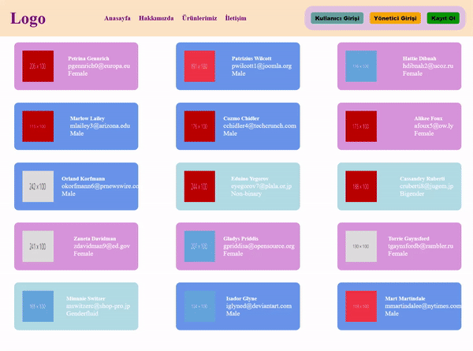

<h1> User Card</h1>

Bu proje React kullanılarak geliştirilmiş basit bir kullanıcı arayüzü uygulamasıdır. Kullanıcı bilgilerini kartlar halinde listeler ve başlık bölümünde kullanıcı girişi ve yönetici seçeneklerini içeren bir navigasyon çubuğu bulunur.

<h2> Proje Detayları </h2>
Bu proje farklı kullanıcıları temsil eden kartları görüntüler. Her kartta şu bilgiler bulunur:

<ul>
<li>Kullanıcı Adı</li>
<li>Kullanıcı Soyadı</li>
<li>E Mail</li>
<li>Cinsiyet</li>
<li>Fotoğraf</li>
</ul>

<h2> Özellikleri</h2>
<ul>
<li><b>Kullanıcı Girişi:</b> Uygulamaya yeni bir kullanıcı ekler ve aktif kullanıcı sayısını artırır.</li>
<li><b>Yönetici Girişi:</b> Yönetici seçeneğiyle aktif kullanıcı sayısını görüntüler.</li>
<li><b>Kayıt Ol:</b> Yeni kullanıcı eklemek için kullanılabilir. Ad, soyad girerek kayıt olunabilir.</li>
<li><b>Aktif Kullanıcı Sayısı:</b> Uygulama, kullanıcı kartlarının sayısını gösterir.
</li>
</ul>

<h2> Kullanilan Teknolojiler </h2>
<ul>
<li>HTML5</li>
<li>CSS</li>
<li>React.js</li>
<li>JavaScript</li>
</ul>

<h2>Ekran Görüntüsü</h2>

